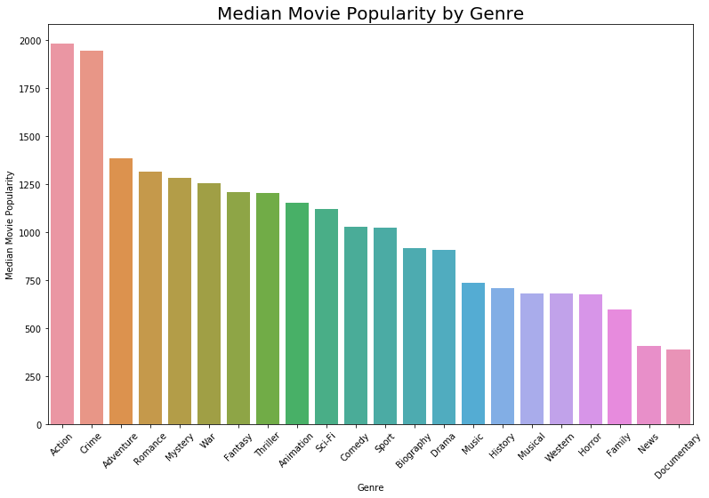

# Microsoft Streaming Movies Analysis

**Author:** Lili Beit
***

## Overview

Microsoft wants to enter the movie business as a creator of original content.  My task is to advise them on how to make popular movies that will draw subscribers to its new streaming video service.  I used data from IMDb, the Internet Movie Database, to investigate three questions:

1. Which movie genres are the most popular?
2. Does the length of a movie affect its ratings and popularity?
3. Who are the top actors and directors in the popular genres?

To measure a film's popularity, I used the product of its average rating and the number of people who rated it.  To find the most popular genres, I calculated the median popularity value for each genre.  I discovered that the most popular movie genres among IMDb users are Action, Crime, and Adventure.  I also analyzed the length of movies in these genres, and found that a longer runtime is correlated with increased popularity.  I then found the 30 actors and directors who have made the most popular movies in these genres.  

## Business Problem

Microsoft sees big tech companies such as Amazon, Netflix, and Hulu successfully drawing customers with streaming video services featuring original content, and so has decided to enter the streaming space.  Microsoft hopes to lure subscribers with original movies, but doesn't know anything about how to make movies that are highly rated and appeal to a wide audience.  They need to generate a few "big win" movies to kickstart their entry into the streaming arena.

## Data

To analyze this problem, I used data from IMDb, the Internet Movie Database.  IMDb contains information on over 140,000 movies, including actors, genres, runtimes, and ratings.  While IMDb does collect information from filmakers, the bulk of its data are submitted by  individuals in the movie industry and visitors to the IMDb website.  

## Results

### Action, Crime, and Adventure win!

Action, Crime, and Adventure emerge as the three most popular genres.  

### Longer movies win!

In all three of the most popular genres, the median length of the top 25% of movies by popularity was significantly (11-15 minutes) longer than the median length of the bottom 75%.  Microsoft should aim for their movies to be between 105 and 110 minutes long.

### Let's get recruiting!

This analysis provides Microsoft with lists of actors and directors who draw large audiences and make highly rated films in all three top genres.  To create a few "big win" movies to build its brand, Microsoft should consider recruiting these individuals.

## Conclusions

### Recommendations:

- To successfully break into the streaming movie business, Microsoft should focus on Action, Crime, and Adventure movies

- Microsoft should make movies that are around 105-110 minutes long

- Microsfot should recruit actors and directors from the "Top 30" lists provided.  These individuals make movies that are highly rated and draw a large audience.

### Further investigation:

-  Although runtime is correlated with ratings and popularity, it's not clear that increased runtime is the cause of increased popularity.  Both factors might share a common cause, such as a large production budget.

- A budget analysis by genre would be helpful so Microsoft can predict the return on investment of its movies.  It is possible that the most popular genres are also the most expensive, and that by going down a few notches to Romance or Mystery, Microsoft could achieve greater profitability.

